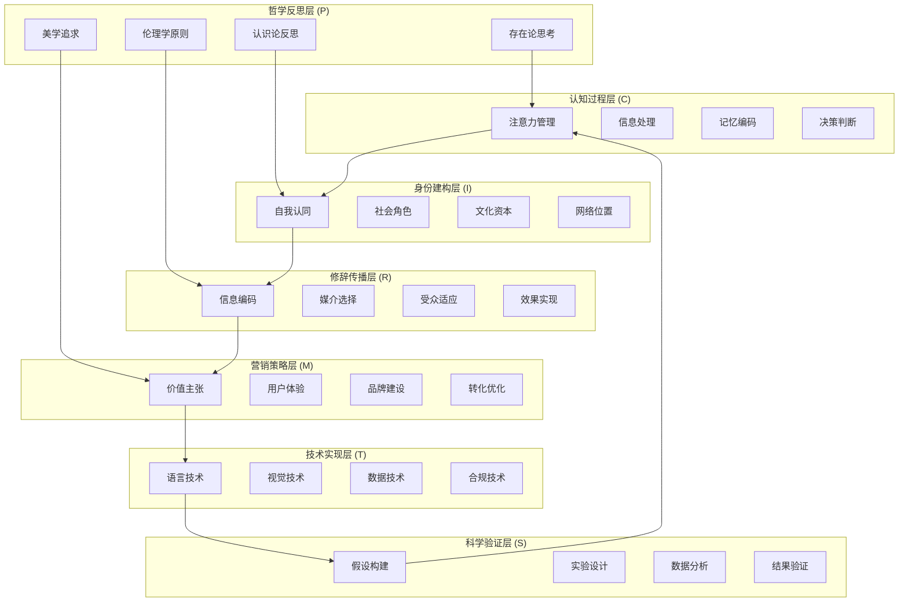

# 简历写作的跨学科模型构建

## 概述

本文整合心理学、社会学、传播学、哲学、科学方法论、营销学和应用技术学科群的理论基础，构建简历写作的跨学科整合模型。该模型旨在提供一个全面、系统、科学的简历写作理论框架，指导实践应用。

## 1. 理论整合的哲学基础

### 1.1 整合的认识论原则

#### 多元认识论视角
```
认识层次：
1. 经验层次：基于观察和测量的实证知识
2. 理论层次：基于逻辑推理的概念知识
3. 实践层次：基于行动和反思的实用知识
4. 智慧层次：基于综合判断的整体认知
```

#### 跨学科对话机制
- **概念翻译**：不同学科术语的相互转换
- **理论整合**：不同理论框架的有机结合
- **方法互补**：不同研究方法的协同应用
- **视角融合**：多重视角的综合理解

### 1.2 系统性整合原则

#### 层次性整合
```
整合层次：
微观层次：个体心理和行为机制
中观层次：社会互动和传播过程
宏观层次：社会结构和文化背景
元层次：哲学反思和方法论指导
```

#### 动态性整合
- **时间维度**：历史发展和未来趋势
- **空间维度**：不同情境和环境
- **过程维度**：动态变化和反馈循环
- **关系维度**：要素间的相互作用

## 2. 核心理论模型（CIRPSMT模型）

### 2.1 模型概述

**CIRPSMT模型**：认知-身份-修辞-哲学-科学-营销-技术整合模型
- **C**ognitive：认知心理学视角
- **I**dentity：身份社会学视角  
- **R**hetorical：修辞传播学视角
- **P**hilosophical：哲学反思视角
- **S**cientific：科学方法论视角
- **M**arketing：营销学视角
- **T**echnical：应用技术学科视角

### 2.2 模型结构



### 2.3 各层次的功能定位

#### 哲学反思层（P层）
```
功能定位：
- 提供价值判断标准
- 确立伦理行为边界
- 引导美学设计原则
- 促进深度自我反思
```

#### 认知过程层（C层）
```
功能定位：
- 理解招聘者心理机制
- 优化信息呈现方式
- 设计记忆增强策略
- 影响决策判断过程
```

#### 身份建构层（I层）
```
功能定位：
- 明确个人身份定位
- 展示社会文化资本
- 激活社会网络资源
- 实现身份认同匹配
```

#### 修辞传播层（R层）
```
功能定位：
- 优化信息编码效率
- 选择最佳传播媒介
- 适应目标受众特征
- 实现预期传播效果
```

#### 营销策略层（M层）
```
功能定位：
- 明确核心价值主张
- 优化用户体验设计
- 构建个人品牌形象
- 实现高效转化目标
```

#### 技术实现层（T层）
```
功能定位：
- 提供语言表达的技术标准
- 实现视觉设计的最优效果
- 支撑数据分析和ATS优化
- 确保法律合规和文化适配
```

#### 科学验证层（S层）
```
功能定位：
- 建立可检验假设
- 设计严格实验方案
- 收集分析客观数据
- 验证理论和策略
```

## 3. 动态交互机制

### 3.1 层间交互模式

#### 向上影响（Bottom-up）
```
影响路径：
S → T：科学发现影响技术标准
T → M：技术实现优化营销策略
M → R：营销洞察影响传播策略
R → I：传播效果塑造身份认知
I → C：身份定位引导认知重点
C → P：认知过程触发哲学思考
```

#### 向下指导（Top-down）
```
指导路径：
P → C：哲学原则指导认知策略
C → I：认知理解指导身份建构
I → R：身份定位指导传播设计
R → M：传播策略指导营销设计
M → T：营销需求指导技术实现
T → S：技术假设指导科学验证
```

### 3.2 反馈循环机制

#### 学习循环
```
循环过程：
实践行动 → 效果观察 → 理论反思 → 策略调整 → 改进实践
```

#### 适应循环
```
循环过程：
环境变化 → 感知识别 → 策略调整 → 行为改变 → 效果评估
```

### 3.3 协同效应机制

#### 理论协同
- **互补性**：不同理论的优势互补
- **一致性**：核心观点的内在一致
- **增强性**：组合效果的协同增强
- **创新性**：跨界整合的理论创新

#### 方法协同
- **多元验证**：多种方法的交叉验证
- **过程协同**：不同阶段的方法配合
- **层次协同**：不同层次的方法整合
- **时间协同**：不同时期的方法演化

## 4. 实践应用模型

### 4.1 简历写作的七阶段模型

#### 第一阶段：哲学反思与自我认知
```
核心任务：
1. 存在论反思：我是谁？我的本质特征是什么？
2. 认识论反思：我如何认识自己和他人？
3. 伦理学反思：我的价值观和行为准则是什么？
4. 美学反思：我追求什么样的美和风格？

输出成果：
- 个人哲学宣言
- 核心价值观澄清
- 伦理边界确定
- 美学偏好识别
```

#### 第二阶段：认知机制分析与策略设计
```
核心任务：
1. 目标受众的认知特征分析
2. 注意力引导策略设计
3. 信息处理优化策略
4. 记忆编码强化策略
5. 决策影响策略制定

输出成果：
- 受众认知画像
- 注意力引导方案
- 信息层次设计
- 记忆增强策略
- 决策影响计划
```

#### 第三阶段：身份建构与资本展示
```
核心任务：
1. 个人身份清晰定位
2. 文化资本盘点整理
3. 社会资本激活利用
4. 符号资本构建展示
5. 身份一致性检验

输出成果：
- 身份定位声明
- 资本展示矩阵
- 网络关系图谱
- 符号系统设计
- 一致性检查表
```

#### 第四阶段：修辞传播设计与实现
```
核心任务：
1. 核心信息提炼编码
2. 修辞策略选择应用
3. 媒介平台选择配置
4. 传播时机规划把握
5. 效果预期设定监测

输出成果：
- 信息编码方案
- 修辞策略组合
- 媒介传播计划
- 时机选择策略
- 效果监测体系
```

#### 第五阶段：营销策略实施与转化优化
```
核心任务：
1. 核心价值主张提炼表达
2. 目标用户体验设计优化
3. 个人品牌形象构建传播
4. 转化漏斗设计与监测
5. 营销效果分析与调整

输出成果：
- 价值主张声明
- 用户体验地图
- 品牌传播策略
- 转化优化方案
- 营销效果报告
```

#### 第六阶段：技术实现与标准化
```
核心任务：
1. 语言技术应用与Plain Language优化
2. 视觉设计技术与用户体验实现
3. ATS系统优化与关键词技术
4. 法律合规检查与隐私保护
5. 跨文化适配与国际标准应用

输出成果：
- 技术标准检查表
- 视觉设计规范
- ATS优化报告
- 合规性验证文档
- 文化适配方案
```

#### 第七阶段：科学验证与持续优化
```
核心任务：
1. 效果假设明确表述
2. 实验方案设计实施
3. 数据收集分析处理
4. 结果验证评估解释
5. 策略优化迭代改进

输出成果：
- 假设检验报告
- 实验设计方案
- 数据分析结果
- 效果评估报告
- 优化改进计划
```

### 4.2 集成决策支持系统

#### 系统架构
```
系统组成：
1. 哲学反思模块：价值观澄清、伦理边界确定
2. 认知分析模块：受众特征分析、策略生成
3. 身份建构模块：资本盘点、身份设计
4. 传播优化模块：编码策略、媒介选择
5. 营销策略模块：价值主张、品牌建设、转化优化
6. 技术实现模块：语言技术、视觉技术、数据技术、合规技术
7. 科学验证模块：假设检验、效果评估
```

#### 决策流程
```
决策步骤：
1. 输入个人信息和目标设定
2. 系统综合分析生成建议
3. 用户确认调整最终方案
4. 实施执行并收集反馈
5. 系统学习优化建议算法
```

## 5. 模型的理论创新点

### 5.1 整合性创新

#### 跨学科整合
- **首次系统整合**：七大学科群的理论整合
- **层次化整合**：从微观到宏观的层次整合
- **动态化整合**：时间和过程的动态整合
- **实践化整合**：理论与实践的有机整合
- **技术化整合**：理论指导与技术实现的双重支撑

#### 方法论创新
- **多元方法论**：定性与定量方法并重
- **循证实践**：基于证据的实践指导
- **反思实践**：理论与实践的螺旋上升
- **系统实践**：整体系统的协同优化

### 5.2 理论深化创新

#### 认知层面深化
- **双重加工**：系统1和系统2的协同设计
- **具身认知**：身体经验对简历理解的影响
- **社会认知**：社会情境对认知过程的调节
- **元认知**：对认知过程的认知和调控

#### 社会层面深化
- **身份流动性**：多重身份的动态协调
- **资本转换**：不同资本形式的相互转化
- **网络效应**：社会网络的复杂影响机制
- **文化适应**：跨文化情境的适应策略

#### 技术层面深化
- **语言技术**：Plain Language与修辞学的技术化应用
- **视觉技术**：字体学、信息架构与用户体验的集成
- **数据技术**：ATS优化、NLP技术与商业分析的融合
- **合规技术**：法律法规、隐私保护与跨文化标准的统一

### 5.3 实践指导创新

#### 个性化指导
- **差异化策略**：根据个体特征的定制策略
- **情境化应用**：根据具体情境的灵活应用
- **发展性规划**：考虑个人发展阶段的动态规划
- **生态化设计**：考虑整个生态系统的协同设计

#### 智能化支持
- **AI辅助决策**：人工智能的决策支持
- **数据驱动优化**：基于大数据的持续优化

#### 技术标准化
- **多层技术标准**：从语言到视觉的全方位技术规范
- **合规自动化**：法律合规和隐私保护的自动检查
- **跨文化适配**：国际标准与本地化需求的平衡
- **质量保证体系**：技术、内容、合规的三重质量控制
- **算法个性化**：机器学习的个性化推荐
- **智能反馈**：实时反馈和动态调整

## 6. 模型验证与评估

### 6.1 理论验证

#### 内在一致性检验
```
检验维度：
1. 逻辑一致性：理论逻辑的内在一致
2. 概念一致性：核心概念的统一理解
3. 价值一致性：价值取向的协调统一
4. 方法一致性：研究方法的相互支撑
```

#### 外在有效性检验
```
检验维度：
1. 预测有效性：理论预测的准确程度
2. 解释有效性：现象解释的充分程度
3. 应用有效性：实践指导的有效程度
4. 普适有效性：跨情境应用的稳定性
```

### 6.2 实践验证

#### 效果验证
```
验证指标：
1. 客观效果：面试邀请率、录用成功率
2. 主观效果：满意度、自信心提升
3. 过程效果：决策效率、学习成长
4. 长期效果：职业发展、人生价值
```

#### 适用性验证
```
验证范围：
1. 不同人群：年龄、学历、经验差异
2. 不同行业：传统、互联网、服务业
3. 不同文化：东西方文化差异
4. 不同时期：经济周期、技术变化
```

## 7. 模型的局限性与发展方向

### 7.1 当前局限性

#### 理论局限
- **复杂性挑战**：模型复杂度与实用性的平衡
- **文化局限**：主要基于特定文化背景的理论
- **时效性限制**：快速变化环境对理论的挑战
- **个体差异**：个体独特性的充分考虑

#### 实践局限
- **实施难度**：完整实施模型的技能要求
- **资源要求**：系统实施所需的时间和资源
- **技术依赖**：对先进技术工具的依赖
- **环境制约**：特定环境条件的限制

### 7.2 未来发展方向

#### 理论发展
```
发展方向：
1. 深化整合：更深层次的跨学科整合
2. 扩展适用：更广泛的适用范围和情境
3. 动态优化：更敏捷的环境适应能力
4. 智能进化：与人工智能的深度融合
```

#### 技术发展
```
发展方向：
1. 智能化：AI驱动的个性化推荐
2. 自动化：自动化的简历生成优化
3. 可视化：直观的分析展示工具
4. 平台化：集成化的服务平台
```

#### 应用发展
```
发展方向：
1. 标准化：行业标准和最佳实践
2. 普及化：降低使用门槛和成本
3. 生态化：构建完整的应用生态
4. 国际化：跨文化的理论和实践
```

## 结论

CIRPS跨学科整合模型为简历写作提供了一个全面、系统、科学的理论框架。该模型整合了心理学、社会学、传播学、哲学和科学方法论的理论精华，建立了从哲学思辨到科学验证的完整链条，为简历写作实践提供了系统性的指导。

模型的核心创新在于：
1. **整合性**：首次系统整合多学科理论
2. **层次性**：建立了清晰的层次结构
3. **动态性**：体现了过程和反馈机制
4. **实践性**：提供了具体的应用指导

## 更新后的结论：CIRPSMT完整模型总结

CIRPSMT跨学科整合框架为简历写作提供了全面的理论基础和技术实现指导。通过整合认知心理学、身份社会学、修辞传播学、哲学反思、科学方法论、营销学和应用技术学科七大理论视角，我们构建了一个既有理论深度又有技术支撑的综合模型。

### 模型的核心价值

#### 理论创新价值
1. **理论完整性**：首次系统整合七大学科群的理论资源
2. **层次化架构**：建立了从哲学思考到技术实现的完整体系
3. **动态交互机制**：构建了各层次间的有机联系和反馈循环

#### 技术实现价值  
1. **标准化规范**：提供了从语言到视觉的全方位技术标准
2. **合规保障**：建立了法律合规和隐私保护的完整框架
3. **国际适配**：实现了跨文化和国际标准的统一适配

#### 实践指导价值
1. **操作框架**：提供了七阶段的具体实施模型
2. **质量保证**：建立了技术、内容、合规的三重质量控制体系
3. **个性化支持**：支持不同情境和需求的定制化应用

#### 科学验证价值
1. **可测试性**：所有理论假设都可以通过科学方法验证
2. **可优化性**：建立了持续改进的机制和标准
3. **可扩展性**：模型具有良好的适应性和发展空间

### 模型的重要意义

这个**理论-技术**双重支撑的框架不仅实现了简历写作的科学化和专业化，更为人力资源管理、教育培训、职业发展等相关领域提供了重要的理论基础和实践工具。

CIRPSMT模型代表了简历写作研究从经验化向科学化、从个人技巧向系统方法、从理论探索向技术实现的重要转变，为这一重要社会实践提供了全面而深入的学术支撑。

未来发展需要在保持理论深度的同时，不断提高技术标准的实用性和可操作性，推动简历写作从经验化向科学化转变，从个人技巧向系统方法演进，从理论指导向技术实现升级。 